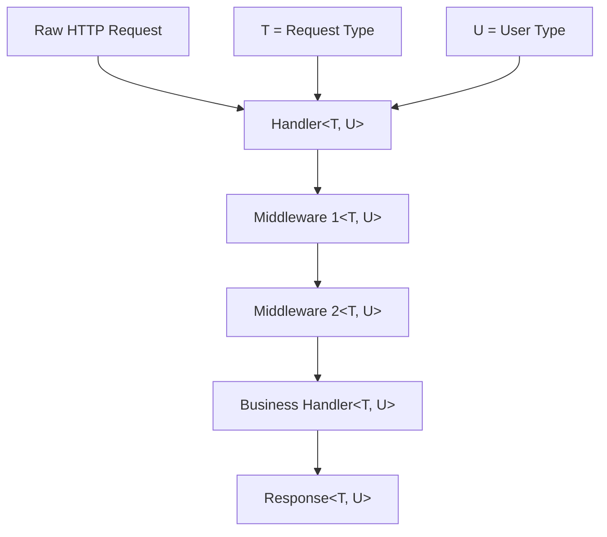
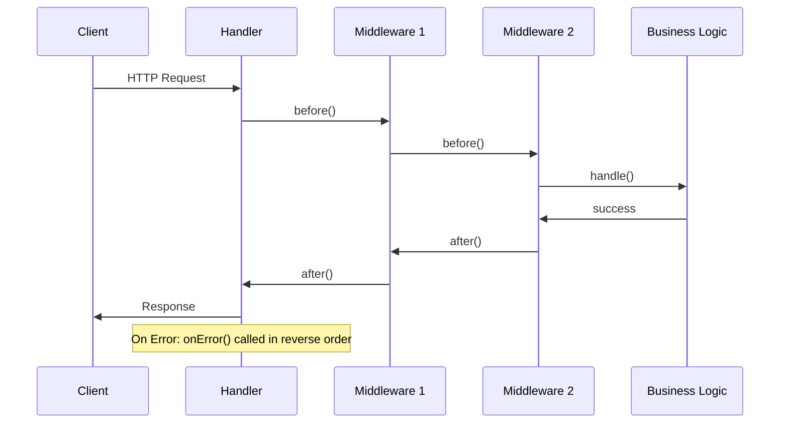

# Noony Handler Complete Guide

A comprehensive guide to understanding and using the `Handler` class with TypeScript generics in the Noony Serverless Framework. This guide covers everything from basic concepts to advanced patterns with detailed examples.

## Table of Contents

1. [Introduction](#introduction)
2. [Core Architecture](#core-architecture)
3. [Understanding Generics](#understanding-generics)
4. [Middleware Lifecycle](#middleware-lifecycle)
5. [Basic Usage Examples](#basic-usage-examples)
6. [Advanced Generic Patterns](#advanced-generic-patterns)
7. [Framework Integration](#framework-integration)
8. [Performance Optimizations](#performance-optimizations)
9. [Best Practices](#best-practices)
10. [Testing Strategies](#testing-strategies)

## Introduction

The `Handler` class is the core orchestrator of the Noony Serverless Framework. It manages middleware execution, provides type safety through TypeScript generics, and offers a framework-agnostic approach to building serverless functions.

### Key Features

- **Type-Safe Pipeline**: Full TypeScript support with generic type flow
- **Middleware Composition**: Fluent API for building processing pipelines
- **Framework Agnostic**: Works with GCP Functions, Express, Fastify, Lambda, etc.
- **Performance Optimized**: Container pooling and pre-computed middleware arrays
- **Error Handling**: Comprehensive error propagation and handling
- **Lifecycle Management**: Before, after, and error hooks for complete control

## Core Architecture

### Handler Class Structure

```typescript
export class Handler<T = unknown, U = unknown> {
  private baseMiddlewares: BaseMiddleware<T, U>[] = [];
  private handler!: (context: Context<T, U>) => Promise<void>;
  
  // Performance optimizations
  private reversedMiddlewares: BaseMiddleware<T, U>[] = [];
  private errorMiddlewares: BaseMiddleware<T, U>[] = [];
  private middlewaresPrecomputed = false;
}
```

**Generic Parameters:**
- `T`: Type of the request data (parsed/validated body)
- `U`: Type of the user/authentication context

### BaseMiddleware Interface

```typescript
export interface BaseMiddleware<T = unknown, U = unknown> {
  before?: (context: Context<T, U>) => Promise<void>;
  after?: (context: Context<T, U>) => Promise<void>;
  onError?: (error: Error, context: Context<T, U>) => Promise<void>;
}
```

**Lifecycle Methods:**
- `before`: Executes before the main handler (preprocessing)
- `after`: Executes after the main handler (postprocessing)
- `onError`: Executes when an error occurs (error handling)

### Context Object

```typescript
export interface Context<T = unknown, V = unknown> {
  readonly req: GenericRequest<T>;           // Request with typed body
  readonly res: GenericResponse;             // Framework-agnostic response
  container?: Container;                     // TypeDI container
  error?: Error | null;                      // Current error (if any)
  readonly businessData: Map<string, unknown>; // Shared middleware data
  user?: V;                                  // Authenticated user context
  readonly startTime: number;                // Request start timestamp
  readonly requestId: string;                // Unique request identifier
  timeoutSignal?: AbortSignal;              // Request timeout signal
  responseData?: unknown;                    // Response data
}
```

## Understanding Generics

### Why Generics?

Generics provide compile-time type safety while maintaining runtime flexibility. They ensure that:

1. **Request data flows correctly** through the middleware pipeline
2. **User context is properly typed** after authentication
3. **Business logic receives validated data** with proper types
4. **IDE provides accurate autocomplete** and error detection

### Generic Type Flow



### Generic Constraints and Transformations

The Handler supports type transformations through the `use` method:

```typescript
use<NewT = T, NewU = U>(
  middleware: BaseMiddleware<NewT, NewU>
): Handler<NewT, NewU>
```

This allows middleware to transform types as they flow through the pipeline.

## Middleware Lifecycle

### Execution Order



### Performance Optimizations

The Handler pre-computes middleware arrays for optimal runtime performance:

```typescript
private precomputeMiddlewareArrays(): void {
  if (this.middlewaresPrecomputed) return;
  
  // Pre-compute reversed array for after/error middlewares
  this.reversedMiddlewares = [...this.baseMiddlewares].reverse();
  this.errorMiddlewares = this.reversedMiddlewares.filter((m) => m.onError);
  
  this.middlewaresPrecomputed = true;
}
```

**Performance Benefits:**
- No runtime array operations
- Reduced garbage collection
- Faster middleware resolution
- Container pooling for TypeDI containers

## Basic Usage Examples

### 1. Simple Handler Without Generics

```typescript
import { Handler, Context } from '@noony-serverless/core';

// Basic handler for simple use cases
const basicHandler = new Handler()
  .handle(async (context: Context) => {
    const name = context.req.body?.name || 'World';
    context.res.json({ message: `Hello, ${name}!` });
  });

// Usage with Google Cloud Functions
export const helloWorld = http('helloWorld', (req, res) => {
  return basicHandler.execute(req, res);
});
```

**When to use:**
- Simple endpoints without complex validation
- Prototyping and quick implementations
- When type safety isn't critical

### 2. Basic Middleware Composition

```typescript
import { 
  Handler, 
  ErrorHandlerMiddleware, 
  ResponseWrapperMiddleware 
} from '@noony-serverless/core';

const composedHandler = new Handler()
  .use(new ErrorHandlerMiddleware())        // Error handling
  .use(new ResponseWrapperMiddleware())     // Response formatting
  .handle(async (context) => {
    // Your business logic here
    return { success: true, data: 'Hello World' };
  });
```

### 3. Custom Middleware Example

```typescript
import { BaseMiddleware, Context } from '@noony-serverless/core';

// Custom logging middleware
class LoggingMiddleware implements BaseMiddleware {
  async before(context: Context): Promise<void> {
    console.log(`[${context.requestId}] Request started:`, {
      method: context.req.method,
      path: context.req.path,
      userAgent: context.req.userAgent
    });
  }

  async after(context: Context): Promise<void> {
    const duration = Date.now() - context.startTime;
    console.log(`[${context.requestId}] Request completed in ${duration}ms`);
  }

  async onError(error: Error, context: Context): Promise<void> {
    console.error(`[${context.requestId}] Request failed:`, error.message);
  }
}

// Usage
const loggedHandler = new Handler()
  .use(new LoggingMiddleware())
  .use(new ErrorHandlerMiddleware())
  .handle(async (context) => {
    return { message: 'This request is logged!' };
  });
```

## Advanced Generic Patterns

### 1. Typed Request Validation with Zod

```typescript
import { z } from 'zod';
import { 
  Handler, 
  BodyValidationMiddleware, 
  Context 
} from '@noony-serverless/core';

// 1. Define Zod schema
const createUserSchema = z.object({
  name: z.string().min(1).max(100),
  email: z.string().email(),
  age: z.number().min(18).max(120),
  role: z.enum(['user', 'admin']).default('user'),
  preferences: z.object({
    newsletter: z.boolean().default(true),
    theme: z.enum(['light', 'dark']).default('light')
  }).optional()
});

// 2. Infer TypeScript type from schema
type CreateUserRequest = z.infer<typeof createUserSchema>;

// 3. Create typed handler
const createUserHandler = new Handler<CreateUserRequest>()
  .use(new ErrorHandlerMiddleware())
  .use(new BodyValidationMiddleware(createUserSchema))
  .use(new ResponseWrapperMiddleware())
  .handle(async (context: Context<CreateUserRequest>) => {
    // context.req.validatedBody is now fully typed!
    const userData = context.req.validatedBody!;
    
    // TypeScript knows these fields exist and their types
    const user = {
      id: generateId(),
      name: userData.name,           // string
      email: userData.email,         // string  
      age: userData.age,             // number
      role: userData.role,           // 'user' | 'admin'
      newsletter: userData.preferences?.newsletter ?? true,
      theme: userData.preferences?.theme ?? 'light',
      createdAt: new Date()
    };
    
    await userService.create(user);
    
    return {
      success: true,
      user: {
        id: user.id,
        name: user.name,
        email: user.email,
        role: user.role
      }
    };
  });
```

**Benefits:**
- Compile-time type checking
- IDE autocomplete and error detection
- Runtime validation with detailed error messages
- Automatic type inference from schemas

### 2. User Authentication Context

```typescript
import { CustomTokenVerificationPort } from '@noony-serverless/core';

// 1. Define user type from authentication
interface AuthenticatedUser {
  id: string;
  email: string;
  name: string;
  roles: string[];
  permissions: string[];
  organizationId: string;
  lastLoginAt: Date;
}

// 2. Create authentication middleware
class JWTAuthMiddleware implements BaseMiddleware<unknown, AuthenticatedUser> {
  constructor(private tokenVerifier: CustomTokenVerificationPort<AuthenticatedUser>) {}

  async before(context: Context<unknown, AuthenticatedUser>): Promise<void> {
    const authHeader = context.req.headers.authorization;
    if (!authHeader?.startsWith('Bearer ')) {
      throw new Error('Authorization header required');
    }

    const token = authHeader.slice('Bearer '.length);
    const user = await this.tokenVerifier.verifyToken(token);
    
    // Set typed user in context
    context.user = user;
  }
}

// 3. Create handler with both request and user types
const secureUserHandler = new Handler<CreateUserRequest, AuthenticatedUser>()
  .use(new ErrorHandlerMiddleware())
  .use(new JWTAuthMiddleware(tokenVerifier))
  .use(new BodyValidationMiddleware(createUserSchema))
  .handle(async (context: Context<CreateUserRequest, AuthenticatedUser>) => {
    const userData = context.req.validatedBody!;  // Type: CreateUserRequest
    const currentUser = context.user!;            // Type: AuthenticatedUser
    
    // Access typed user properties
    console.log(`User ${currentUser.name} (${currentUser.email}) creating user ${userData.name}`);
    
    // Check permissions
    if (!currentUser.permissions.includes('user:create')) {
      throw new Error('Insufficient permissions');
    }
    
    // Business logic with full type safety
    const newUser = await userService.create({
      ...userData,
      createdBy: currentUser.id,
      organizationId: currentUser.organizationId
    });
    
    return { success: true, user: newUser };
  });
```

### 3. Multi-Step Type Transformations

```typescript
// Step 1: Raw request data
interface RawOrderData {
  productId: string;
  quantity: number;
  customizations?: Record<string, unknown>;
}

// Step 2: Validated and enriched data
interface ValidatedOrderData extends RawOrderData {
  productDetails: {
    name: string;
    price: number;
    available: boolean;
  };
  totalPrice: number;
  estimatedDelivery: Date;
}

// Step 3: Final processed order
interface ProcessedOrder extends ValidatedOrderData {
  orderId: string;
  status: 'pending' | 'confirmed' | 'failed';
  paymentIntentId?: string;
}

// Middleware that transforms raw data to validated data
class ProductValidationMiddleware implements BaseMiddleware<RawOrderData, AuthenticatedUser> {
  async before(context: Context<RawOrderData, AuthenticatedUser>): Promise<void> {
    const rawData = context.req.validatedBody!;
    
    // Fetch product details
    const product = await productService.getById(rawData.productId);
    if (!product) {
      throw new Error('Product not found');
    }
    
    if (!product.available || product.stock < rawData.quantity) {
      throw new Error('Product not available');
    }
    
    // Transform the data
    const validatedData: ValidatedOrderData = {
      ...rawData,
      productDetails: {
        name: product.name,
        price: product.price,
        available: product.available
      },
      totalPrice: product.price * rawData.quantity,
      estimatedDelivery: calculateDeliveryDate(product.location, context.user?.address)
    };
    
    // Store in business data for next middleware
    context.businessData.set('validatedOrder', validatedData);
  }
}

// Handler with type transformation
const orderHandler = new Handler<RawOrderData, AuthenticatedUser>()
  .use(new ErrorHandlerMiddleware())
  .use(new JWTAuthMiddleware(tokenVerifier))
  .use(new BodyValidationMiddleware(rawOrderSchema))
  .use(new ProductValidationMiddleware())
  .handle(async (context: Context<RawOrderData, AuthenticatedUser>) => {
    const validatedOrder = context.businessData.get('validatedOrder') as ValidatedOrderData;
    const user = context.user!;
    
    try {
      // Process payment
      const paymentIntent = await paymentService.createIntent({
        amount: validatedOrder.totalPrice,
        currency: 'usd',
        customerId: user.id
      });
      
      // Create order
      const processedOrder: ProcessedOrder = {
        ...validatedOrder,
        orderId: generateOrderId(),
        status: 'pending',
        paymentIntentId: paymentIntent.id
      };
      
      await orderService.create(processedOrder);
      
      return {
        success: true,
        order: {
          id: processedOrder.orderId,
          total: processedOrder.totalPrice,
          estimatedDelivery: processedOrder.estimatedDelivery,
          paymentIntentId: processedOrder.paymentIntentId
        }
      };
    } catch (error) {
      const failedOrder: ProcessedOrder = {
        ...validatedOrder,
        orderId: generateOrderId(),
        status: 'failed'
      };
      
      await orderService.create(failedOrder);
      throw error;
    }
  });
```

### 4. Generic Middleware Factory

```typescript
// Generic middleware factory for common patterns
class ValidationMiddlewareFactory {
  static createTypedValidator<T>(
    schema: z.ZodType<T>,
    options: {
      source?: 'body' | 'query' | 'params';
      required?: boolean;
      transform?: (data: T) => T;
    } = {}
  ): BaseMiddleware<T> {
    return {
      async before(context: Context<T>): Promise<void> {
        const { source = 'body', required = true, transform } = options;
        
        let data: unknown;
        switch (source) {
          case 'body':
            data = context.req.body || context.req.parsedBody;
            break;
          case 'query':
            data = context.req.query;
            break;
          case 'params':
            data = context.req.params;
            break;
        }
        
        if (!data && required) {
          throw new Error(`${source} data is required`);
        }
        
        if (data) {
          try {
            let validatedData = await schema.parseAsync(data);
            
            if (transform) {
              validatedData = transform(validatedData);
            }
            
            // Set validated data based on source
            if (source === 'body') {
              (context.req as any).validatedBody = validatedData;
            } else {
              context.businessData.set(`validated${source}`, validatedData);
            }
          } catch (error) {
            throw new Error(`${source} validation failed: ${error.message}`);
          }
        }
      }
    };
  }
  
  static createPermissionGuard<U>(
    requiredPermissions: string[],
    options: {
      requireAll?: boolean;
      customCheck?: (user: U, permissions: string[]) => boolean;
    } = {}
  ): BaseMiddleware<unknown, U> {
    return {
      async before(context: Context<unknown, U>): Promise<void> {
        if (!context.user) {
          throw new Error('Authentication required');
        }
        
        const { requireAll = false, customCheck } = options;
        
        if (customCheck) {
          if (!customCheck(context.user, requiredPermissions)) {
            throw new Error('Permission denied');
          }
          return;
        }
        
        // Default permission checking logic
        const userPermissions = (context.user as any).permissions || [];
        
        const hasPermission = requireAll
          ? requiredPermissions.every(p => userPermissions.includes(p))
          : requiredPermissions.some(p => userPermissions.includes(p));
        
        if (!hasPermission) {
          throw new Error(`Required permissions: ${requiredPermissions.join(', ')}`);
        }
      }
    };
  }
}

// Usage of generic middleware factory
const adminUserHandler = new Handler<CreateUserRequest, AuthenticatedUser>()
  .use(new ErrorHandlerMiddleware())
  .use(new JWTAuthMiddleware(tokenVerifier))
  .use(ValidationMiddlewareFactory.createTypedValidator(createUserSchema, {
    transform: (data) => ({
      ...data,
      email: data.email.toLowerCase(), // Normalize email
      name: data.name.trim()           // Trim whitespace
    })
  }))
  .use(ValidationMiddlewareFactory.createPermissionGuard<AuthenticatedUser>(
    ['user:create', 'admin:users'], 
    { requireAll: false } // User needs either permission
  ))
  .handle(async (context: Context<CreateUserRequest, AuthenticatedUser>) => {
    // Fully typed and validated context
    const userData = context.req.validatedBody!;
    const currentUser = context.user!;
    
    const newUser = await userService.create({
      ...userData,
      createdBy: currentUser.id,
      organizationId: currentUser.organizationId
    });
    
    return { success: true, user: newUser };
  });
```

## Framework Integration

### Google Cloud Functions

```typescript
import { http, Request, Response } from '@google-cloud/functions-framework';

// Direct integration
export const myFunction = http('myFunction', (req: Request, res: Response) => {
  return myHandler.execute(req, res);
});
```

### Express.js Integration

```typescript
import express from 'express';
import { Handler } from '@noony-serverless/core';

const app = express();

// Convert Express req/res to Generic format
function adaptExpressToGeneric(req: express.Request, res: express.Response) {
  const genericReq = {
    method: req.method,
    url: req.url,
    path: req.path,
    headers: req.headers,
    query: req.query,
    params: req.params,
    body: req.body,
    ip: req.ip,
    userAgent: req.get('user-agent')
  };
  
  const genericRes = {
    status: (code: number) => { res.status(code); return genericRes; },
    json: (data: any) => res.json(data),
    send: (data: any) => res.send(data),
    header: (name: string, value: string) => { res.header(name, value); return genericRes; },
    headers: (headers: Record<string, string>) => { res.set(headers); return genericRes; },
    end: () => res.end(),
    statusCode: res.statusCode,
    headersSent: res.headersSent
  };
  
  return { genericReq, genericRes };
}

// Use with Express
app.post('/users', async (req, res) => {
  const { genericReq, genericRes } = adaptExpressToGeneric(req, res);
  await createUserHandler.executeGeneric(genericReq, genericRes);
});

app.listen(3000);
```

### Fastify Integration

```typescript
import Fastify from 'fastify';
import { Handler } from '@noony-serverless/core';

const fastify = Fastify();

// Fastify adapter
function adaptFastifyToGeneric(request: any, reply: any) {
  const genericReq = {
    method: request.method,
    url: request.url,
    path: request.routerPath,
    headers: request.headers,
    query: request.query,
    params: request.params,
    body: request.body,
    ip: request.ip,
    userAgent: request.headers['user-agent']
  };
  
  const genericRes = {
    status: (code: number) => { reply.status(code); return genericRes; },
    json: (data: any) => reply.send(data),
    send: (data: any) => reply.send(data),
    header: (name: string, value: string) => { reply.header(name, value); return genericRes; },
    headers: (headers: Record<string, string>) => { 
      Object.entries(headers).forEach(([k, v]) => reply.header(k, v)); 
      return genericRes; 
    },
    end: () => reply.send(),
    get statusCode() { return reply.statusCode; },
    get headersSent() { return reply.sent; }
  };
  
  return { genericReq, genericRes };
}

// Register route with Noony handler
fastify.post('/users', async (request, reply) => {
  const { genericReq, genericRes } = adaptFastifyToGeneric(request, reply);
  await createUserHandler.executeGeneric(genericReq, genericRes);
});

await fastify.listen({ port: 3000 });
```

### AWS Lambda Integration

```typescript
import { APIGatewayProxyHandler, APIGatewayProxyEvent, Context as LambdaContext } from 'aws-lambda';

// Lambda adapter
function adaptLambdaToGeneric(event: APIGatewayProxyEvent, context: LambdaContext) {
  const genericReq = {
    method: event.httpMethod,
    url: event.path,
    path: event.path,
    headers: event.headers || {},
    query: event.queryStringParameters || {},
    params: event.pathParameters || {},
    body: event.body ? JSON.parse(event.body) : undefined,
    ip: event.requestContext.identity.sourceIp,
    userAgent: event.headers['User-Agent']
  };
  
  let responseBody: any;
  let statusCode = 200;
  let responseHeaders: Record<string, string> = {};
  
  const genericRes = {
    status: (code: number) => { statusCode = code; return genericRes; },
    json: (data: any) => { responseBody = data; },
    send: (data: any) => { responseBody = data; },
    header: (name: string, value: string) => { 
      responseHeaders[name] = value; 
      return genericRes; 
    },
    headers: (headers: Record<string, string>) => { 
      responseHeaders = { ...responseHeaders, ...headers }; 
      return genericRes; 
    },
    end: () => {},
    statusCode,
    headersSent: false,
    
    // Lambda-specific method to get final response
    toLambdaResponse: () => ({
      statusCode,
      headers: responseHeaders,
      body: JSON.stringify(responseBody)
    })
  };
  
  return { genericReq, genericRes };
}

export const lambdaHandler: APIGatewayProxyHandler = async (event, context) => {
  const { genericReq, genericRes } = adaptLambdaToGeneric(event, context);
  
  await createUserHandler.executeGeneric(genericReq, genericRes);
  
  return (genericRes as any).toLambdaResponse();
};
```

## Performance Optimizations

### Container Pooling

The Handler uses container pooling to avoid creating new TypeDI containers for each request:

```typescript
// Performance optimization: Use container pool instead of creating new containers
const container = containerPool.acquire();
const context = createContext<T, U>(genericReq, genericRes, { container });

try {
  // Execute middleware pipeline
  await this.executeBeforeMiddlewares(context);
  await this.handler(context);
  await this.executeAfterMiddlewares(context);
} finally {
  // Always return container to pool for reuse
  containerPool.release(container);
}
```

### Pre-computed Middleware Arrays

Middleware arrays are computed once when the handler is created:

```typescript
private precomputeMiddlewareArrays(): void {
  if (this.middlewaresPrecomputed) return;
  
  // Pre-compute reversed array for after/error middlewares
  this.reversedMiddlewares = [...this.baseMiddlewares].reverse();
  this.errorMiddlewares = this.reversedMiddlewares.filter((m) => m.onError);
  
  this.middlewaresPrecomputed = true;
}
```

### Performance Monitoring Middleware

```typescript
class PerformanceMiddleware implements BaseMiddleware {
  private metrics = new Map<string, number[]>();
  
  async before(context: Context): Promise<void> {
    context.businessData.set('startTime', process.hrtime.bigint());
  }
  
  async after(context: Context): Promise<void> {
    const startTime = context.businessData.get('startTime') as bigint;
    const duration = Number(process.hrtime.bigint() - startTime) / 1_000_000; // Convert to ms
    
    const route = `${context.req.method} ${context.req.path}`;
    if (!this.metrics.has(route)) {
      this.metrics.set(route, []);
    }
    
    this.metrics.get(route)!.push(duration);
    
    // Log slow requests
    if (duration > 1000) {
      console.warn(`Slow request detected: ${route} took ${duration.toFixed(2)}ms`);
    }
    
    // Keep only last 100 measurements per route
    const measurements = this.metrics.get(route)!;
    if (measurements.length > 100) {
      measurements.splice(0, measurements.length - 100);
    }
  }
  
  getStats() {
    const stats: Record<string, { count: number; avg: number; max: number; min: number }> = {};
    
    for (const [route, measurements] of this.metrics) {
      const count = measurements.length;
      const avg = measurements.reduce((a, b) => a + b, 0) / count;
      const max = Math.max(...measurements);
      const min = Math.min(...measurements);
      
      stats[route] = { count, avg: Number(avg.toFixed(2)), max, min };
    }
    
    return stats;
  }
}

// Usage
const performanceMonitor = new PerformanceMiddleware();

const monitoredHandler = new Handler()
  .use(performanceMonitor)
  .use(new ErrorHandlerMiddleware())
  .handle(async (context) => {
    // Your business logic
    return { message: 'Success' };
  });

// Get performance stats
console.log(performanceMonitor.getStats());
```

## Best Practices

### 1. Generic Usage Guidelines

**When to use generics:**
- ✅ When you have strict request validation requirements
- ✅ When you need typed user authentication context
- ✅ When building reusable middleware components
- ✅ When type safety is critical for business logic

**When to avoid generics:**
- ❌ Simple prototypes or one-off functions
- ❌ When request structure is completely dynamic
- ❌ When the overhead of type definitions isn't justified

### 2. Middleware Ordering

**Recommended order:**
1. **Error Handler** - Always first to catch all errors
2. **Performance/Logging** - Early to measure full request lifecycle
3. **Security** - CORS, rate limiting, basic security checks
4. **Authentication** - User identification and verification
5. **Body Parsing** - Parse request body into usable format
6. **Validation** - Validate parsed data against schemas
7. **Authorization** - Check user permissions for specific actions
8. **Business Logic** - Your core handler function
9. **Response Formatting** - Standard response structure
10. **Cleanup/Monitoring** - Final cleanup and metrics

### 3. Error Handling Strategy

```typescript
// Create custom error types for better error handling
class ValidationError extends Error {
  constructor(message: string, public field: string, public code: string) {
    super(message);
    this.name = 'ValidationError';
  }
}

class AuthenticationError extends Error {
  constructor(message: string = 'Authentication required') {
    super(message);
    this.name = 'AuthenticationError';
  }
}

class AuthorizationError extends Error {
  constructor(message: string = 'Insufficient permissions') {
    super(message);
    this.name = 'AuthorizationError';
  }
}

// Custom error handler middleware
class CustomErrorHandler implements BaseMiddleware {
  async onError(error: Error, context: Context): Promise<void> {
    let statusCode = 500;
    let errorResponse = {
      success: false,
      error: 'Internal Server Error',
      code: 'INTERNAL_ERROR'
    };
    
    if (error instanceof ValidationError) {
      statusCode = 400;
      errorResponse = {
        success: false,
        error: error.message,
        code: error.code,
        field: error.field
      };
    } else if (error instanceof AuthenticationError) {
      statusCode = 401;
      errorResponse = {
        success: false,
        error: error.message,
        code: 'AUTHENTICATION_REQUIRED'
      };
    } else if (error instanceof AuthorizationError) {
      statusCode = 403;
      errorResponse = {
        success: false,
        error: error.message,
        code: 'INSUFFICIENT_PERMISSIONS'
      };
    }
    
    // Log error details server-side
    console.error(`Error in ${context.requestId}:`, {
      error: error.message,
      stack: error.stack,
      path: context.req.path,
      method: context.req.method,
      userAgent: context.req.userAgent,
      ip: context.req.ip
    });
    
    // Send sanitized error to client
    context.res.status(statusCode).json({
      ...errorResponse,
      requestId: context.requestId,
      timestamp: new Date().toISOString()
    });
  }
}
```

### 4. Type Safety Patterns

```typescript
// Use type guards for runtime type checking
function isValidUser(user: unknown): user is AuthenticatedUser {
  return (
    typeof user === 'object' &&
    user !== null &&
    typeof (user as any).id === 'string' &&
    typeof (user as any).email === 'string' &&
    Array.isArray((user as any).roles)
  );
}

// Safe context data access
function getBusinessData<T>(context: Context, key: string, guard: (value: unknown) => value is T): T | null {
  const value = context.businessData.get(key);
  return guard(value) ? value : null;
}

// Usage in handler
.handle(async (context: Context<CreateUserRequest, AuthenticatedUser>) => {
  // Type-safe user access
  if (!context.user || !isValidUser(context.user)) {
    throw new AuthenticationError('Invalid user context');
  }
  
  // Type-safe business data access
  const validatedOrder = getBusinessData(
    context, 
    'validatedOrder', 
    (value): value is ValidatedOrderData => 
      typeof value === 'object' && value !== null && 'totalPrice' in value
  );
  
  if (!validatedOrder) {
    throw new Error('Order validation failed');
  }
  
  // Continue with type-safe operations...
});
```

### 5. Testing Strategies

```typescript
import { Handler, Context } from '@noony-serverless/core';

// Create test context factory
function createTestContext<T, U>(
  overrides: Partial<Context<T, U>> = {}
): Context<T, U> {
  return {
    req: {
      method: 'POST',
      url: '/test',
      path: '/test',
      headers: {},
      query: {},
      params: {},
      body: {},
      ...overrides.req
    },
    res: {
      status: jest.fn().mockReturnThis(),
      json: jest.fn(),
      send: jest.fn(),
      header: jest.fn().mockReturnThis(),
      headers: jest.fn().mockReturnThis(),
      end: jest.fn()
    },
    businessData: new Map(),
    startTime: Date.now(),
    requestId: 'test-request-id',
    ...overrides
  } as Context<T, U>;
}

// Test individual middleware
describe('ValidationMiddleware', () => {
  it('should validate request body', async () => {
    const middleware = new BodyValidationMiddleware(createUserSchema);
    const context = createTestContext<CreateUserRequest>({
      req: {
        body: {
          name: 'John Doe',
          email: 'john@example.com',
          age: 25
        }
      }
    });
    
    await middleware.before!(context);
    
    expect(context.req.validatedBody).toEqual({
      name: 'John Doe',
      email: 'john@example.com',
      age: 25,
      role: 'user' // Default value
    });
  });
  
  it('should throw error for invalid data', async () => {
    const middleware = new BodyValidationMiddleware(createUserSchema);
    const context = createTestContext({
      req: {
        body: {
          name: '',  // Invalid: too short
          email: 'invalid-email',  // Invalid: not an email
          age: 15   // Invalid: too young
        }
      }
    });
    
    await expect(middleware.before!(context)).rejects.toThrow('Validation error');
  });
});

// Test complete handler
describe('CreateUserHandler', () => {
  it('should create user successfully', async () => {
    const mockUserService = {
      create: jest.fn().mockResolvedValue({ id: '123', name: 'John Doe' })
    };
    
    const context = createTestContext<CreateUserRequest, AuthenticatedUser>({
      req: {
        validatedBody: {
          name: 'John Doe',
          email: 'john@example.com',
          age: 25,
          role: 'user'
        }
      },
      user: {
        id: 'current-user-id',
        email: 'admin@example.com',
        name: 'Admin User',
        roles: ['admin'],
        permissions: ['user:create'],
        organizationId: 'org-123',
        lastLoginAt: new Date()
      }
    });
    
    // Mock the handler function
    const handler = jest.fn().mockImplementation(async (ctx) => {
      const userData = ctx.req.validatedBody;
      const currentUser = ctx.user;
      
      const newUser = await mockUserService.create({
        ...userData,
        createdBy: currentUser.id,
        organizationId: currentUser.organizationId
      });
      
      ctx.res.json({ success: true, user: newUser });
    });
    
    await handler(context);
    
    expect(mockUserService.create).toHaveBeenCalledWith({
      name: 'John Doe',
      email: 'john@example.com',
      age: 25,
      role: 'user',
      createdBy: 'current-user-id',
      organizationId: 'org-123'
    });
    
    expect(context.res.json).toHaveBeenCalledWith({
      success: true,
      user: { id: '123', name: 'John Doe' }
    });
  });
});

// Integration test with real handler
describe('Handler Integration', () => {
  it('should handle complete request flow', async () => {
    const handler = new Handler<CreateUserRequest, AuthenticatedUser>()
      .use(new ErrorHandlerMiddleware())
      .use(new BodyValidationMiddleware(createUserSchema))
      .handle(async (context) => {
        const userData = context.req.validatedBody!;
        context.res.json({ success: true, user: userData });
      });
    
    // Create mock request/response
    const mockReq = {
      method: 'POST',
      url: '/users',
      headers: { 'content-type': 'application/json' },
      body: {
        name: 'John Doe',
        email: 'john@example.com',
        age: 25
      }
    };
    
    const mockRes = {
      status: jest.fn().mockReturnThis(),
      json: jest.fn(),
      send: jest.fn(),
      header: jest.fn().mockReturnThis(),
      headers: jest.fn().mockReturnThis(),
      end: jest.fn()
    };
    
    await handler.executeGeneric(mockReq as any, mockRes as any);
    
    expect(mockRes.json).toHaveBeenCalledWith({
      success: true,
      user: {
        name: 'John Doe',
        email: 'john@example.com',
        age: 25,
        role: 'user'
      }
    });
  });
});
```

## Conclusion

The Noony Handler class provides a powerful, type-safe foundation for building serverless functions with TypeScript. Its generic system ensures compile-time type safety while maintaining runtime flexibility, and its middleware pipeline allows for clean separation of concerns.

Key takeaways:

1. **Use generics when type safety matters** - for validated requests and authenticated users
2. **Leverage the middleware pipeline** - separate authentication, validation, and business logic
3. **Follow proper ordering** - error handling first, validation before business logic
4. **Design for reusability** - create generic middleware factories for common patterns
5. **Test thoroughly** - use the test context factory for comprehensive testing
6. **Monitor performance** - use the built-in optimizations and add custom monitoring
7. **Handle errors gracefully** - implement comprehensive error handling strategies

The Handler class is framework-agnostic, performant, and provides excellent developer experience through TypeScript integration. Whether you're building simple APIs or complex serverless applications, the Handler provides the foundation for scalable, maintainable code.