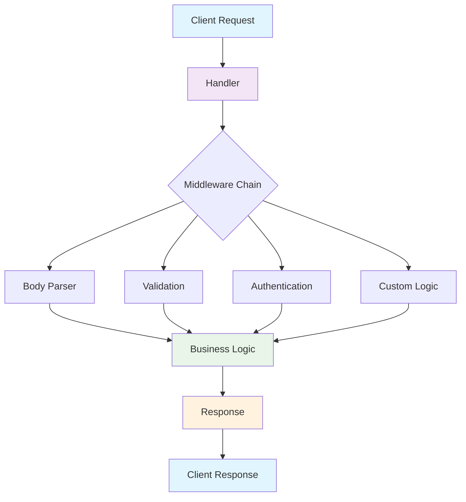
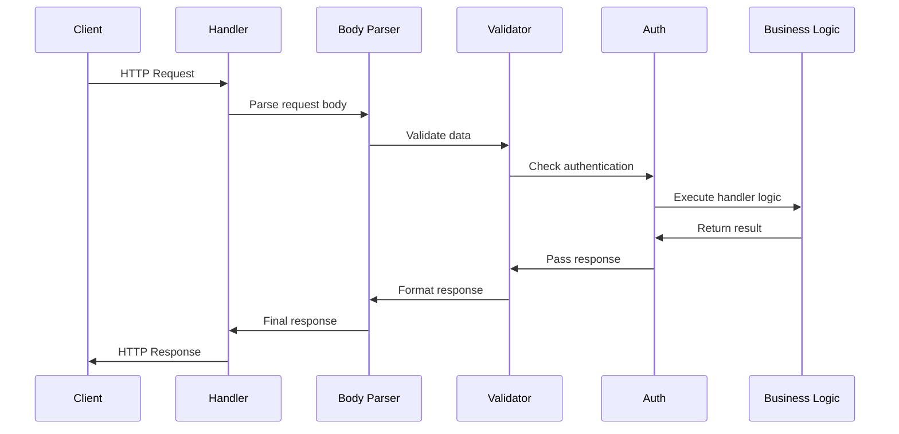
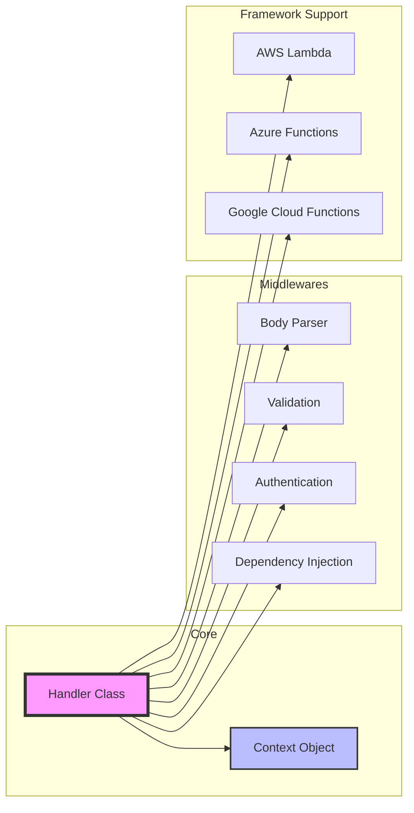
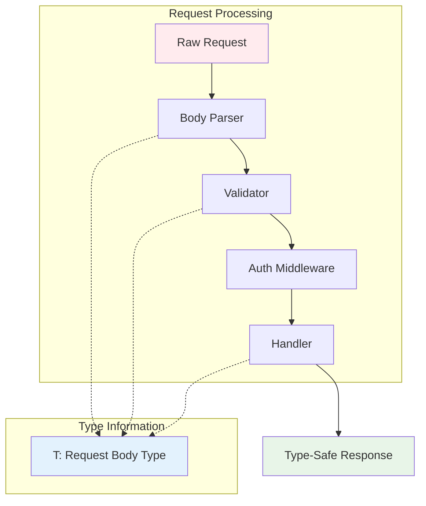
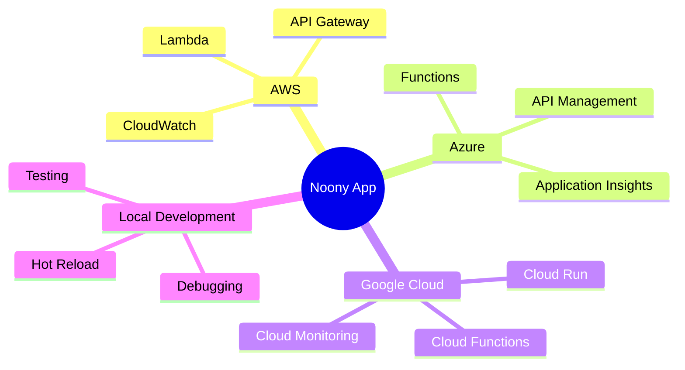

# Architecture Overview

Understanding the Noony Framework architecture helps you build better serverless applications. This overview shows how different components work together.

## Framework Architecture

## Middleware Flow

The middleware system processes requests in a specific order:

## Component Dependencies

## Type Safety Flow

One of Noony's key strengths is end-to-end type safety:

## Deployment Targets

Noony is framework-agnostic and supports multiple deployment targets:

This architecture ensures that your application code remains the same regardless of where you deploy it, while still taking advantage of platform-specific optimizations.
