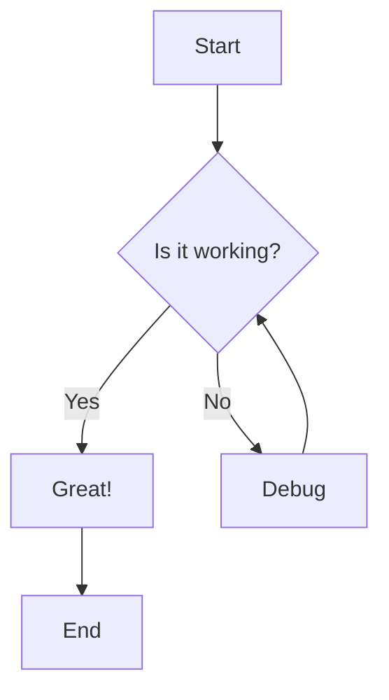
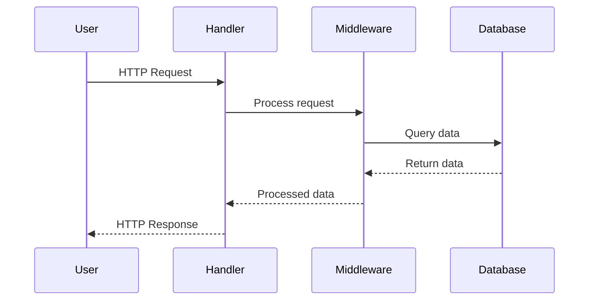
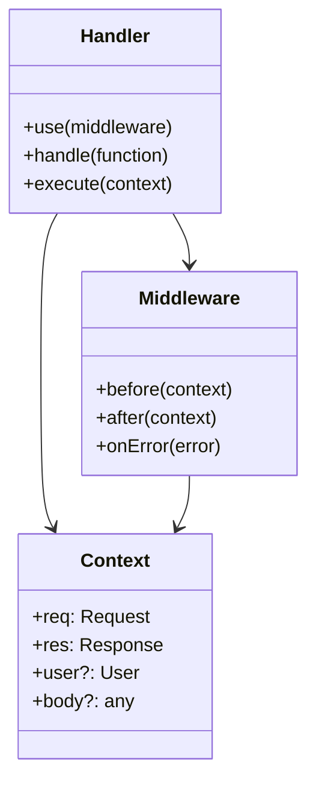
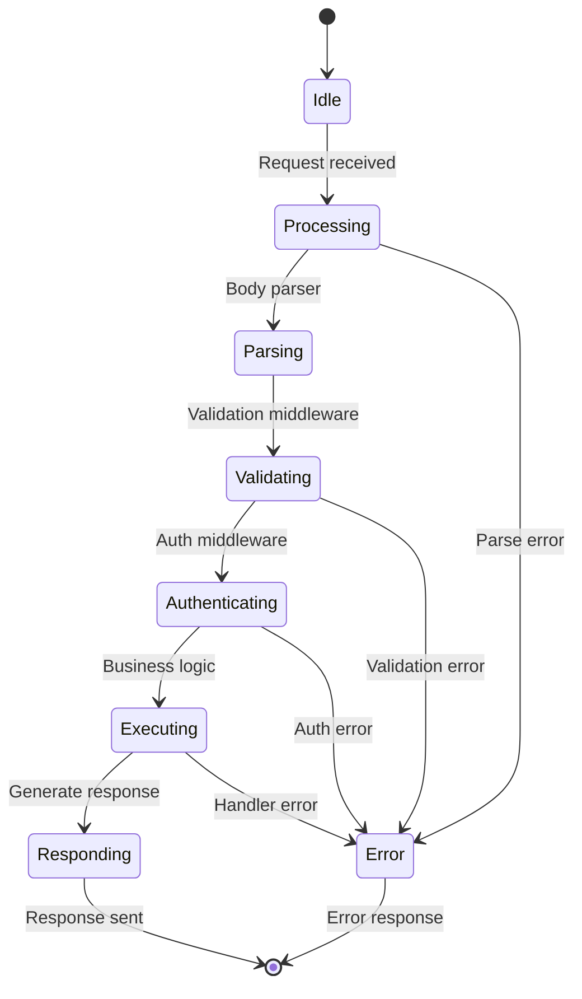
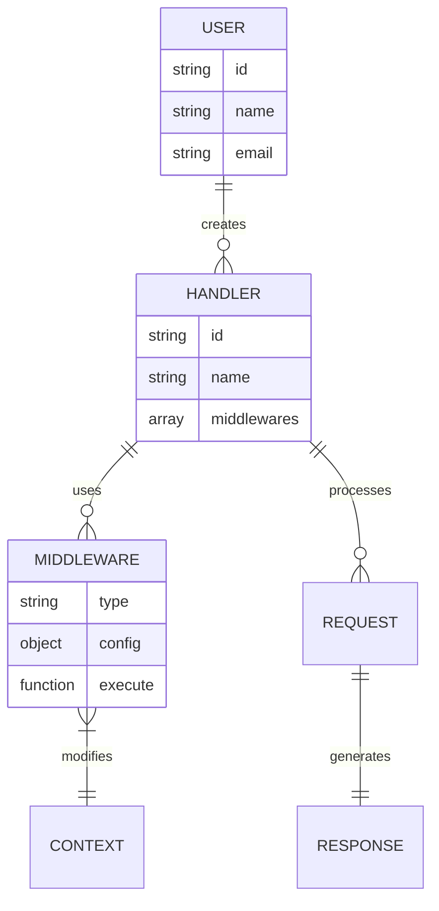
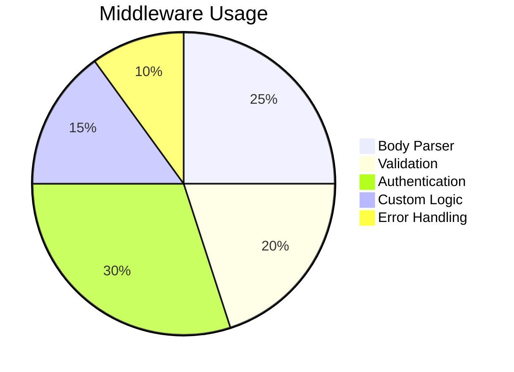
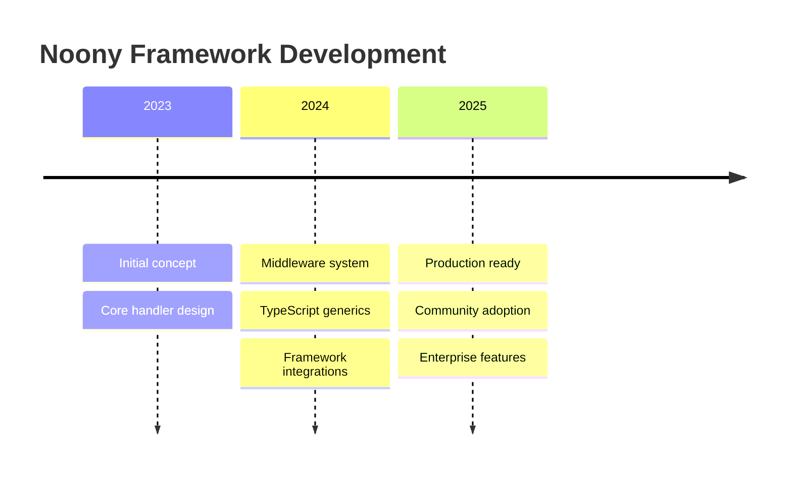

# Diagrams & Visualizations

Noony documentation now supports Mermaid diagrams! Here are some examples of what you can create:

## Basic Flowchart



## Sequence Diagram



## Class Diagram



## State Diagram



## Git Graph

```mermaid
gitgraph
    commit id: "Initial"
    branch feature
    checkout feature
    commit id: "Add middleware"
    commit id: "Add tests"
    checkout main
    commit id: "Bug fix"
    merge feature
    commit id: "Release v1.0"
```

## Entity Relationship



## Pie Chart



## Timeline



These diagrams make your documentation much more visual and easier to understand!
