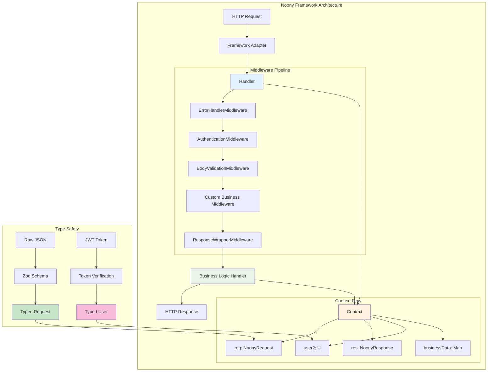
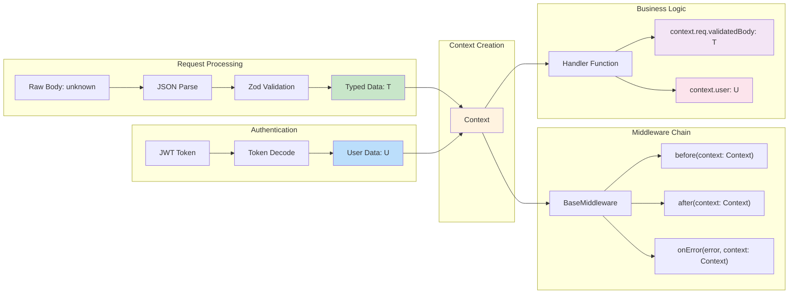

# Noony Framework Complete Guide

**The definitive guide to the Noony serverless middleware framework with TypeScript generics**

> This is your single source of truth for everything Noony. Every example includes full type safety with generics.

## Table of Contents

1. [Quick Start](#quick-start)
2. [Core Concepts with Generics](#core-concepts-with-generics)
3. [Basic Patterns](#basic-patterns)
4. [Intermediate Patterns](#intermediate-patterns)
5. [Advanced Patterns](#advanced-patterns)
6. [Functional Programming](#functional-programming)
7. [Production Examples](#production-examples)
8. [Best Practices](#best-practices)
9. [When to Use What](#when-to-use-what)

---

## Quick Start

### Installation and Basic Setup

```typescript
import { 
  Handler, 
  Context, 
  BaseMiddleware,
  ErrorHandlerMiddleware,
  BodyValidationMiddleware,
  ResponseWrapperMiddleware 
} from '@noony/core';
import { z } from 'zod';

// 1. Define your request type with Zod
const createUserSchema = z.object({
  name: z.string().min(2, 'Name must be at least 2 characters'),
  email: z.string().email('Must be a valid email'),
  age: z.number().min(18, 'Must be 18 or older')
});

// 2. Infer TypeScript types from schema
type CreateUserRequest = z.infer<typeof createUserSchema>;

// 3. Define your user type (what goes in context.user)
interface User {
  id: string;
  role: 'user' | 'admin';
  tenantId: string;
}

// 4. Create handler with type-safe request handling
const createUserHandler = new Handler<CreateUserRequest>()
  .use(new ErrorHandlerMiddleware())
  .use(new BodyValidationMiddleware(createUserSchema))
  .use(new ResponseWrapperMiddleware())
  .handle(async (context: Context<CreateUserRequest>) => {
    // TypeScript knows exactly what types these are!
    const { name, email, age } = context.req.validatedBody!; // Type: CreateUserRequest
    const user = context.user as User; // User type from authentication middleware
    
    // Business logic with full type safety
    const newUser = await userService.create({ name, email, age, createdBy: user.id });
    
    context.res.json({ user: newUser });
  });

// 5. Export for Google Cloud Functions
export const createUser = http('createUser', (req, res) => 
  createUserHandler.execute(req, res)
);
```

**Key Takeaway**: Always use `Handler<RequestType>` and `Context<RequestType>` for type safety. User types are inferred from authentication middleware and accessed via `context.user`.

---

## Core Concepts with Generics

### Framework Architecture Overview



### Generic Type Flow



### `Handler<T>`

The Handler is the core orchestrator with two generic types:
- **T**: The validated request body type
- **U**: The authenticated user type

```typescript
// Generic Handler signature
class Handler<T = unknown> {
  use(middleware: BaseMiddleware<T>): Handler<T>
  handle(businessLogic: (context: Context<T>) => Promise<void>): void
  execute(req: any, res: any): Promise<void>
}
```

### `Context<T>`

The Context carries type-safe data through the middleware chain:

```typescript
interface Context<T = unknown> {
  req: {
    body?: any;
    parsedBody?: any;
    validatedBody?: T;  // Always type T after validation
    headers: Record<string, string | string[]>;
    query?: Record<string, any>;
    params?: Record<string, any>;
  };
  res: {
    status(code: number): this;
    json(data: any): void;
    send(data: any): void;
  };
  user?: U;  // Always type U after authentication
  requestId: string;
  startTime: number;
  businessData?: Map<string, any>;
}
```

### `BaseMiddleware<T>`

All middleware implements this generic interface:

```typescript
interface BaseMiddleware<T = unknown> {
  before?(context: Context<T>): Promise<void>;
  after?(context: Context<T>): Promise<void>;
  onError?(error: Error, context: Context<T>): Promise<void>;
}
```

**Custom Middleware Example**:

```typescript
class LoggingMiddleware<T, U> implements BaseMiddleware<T> {
  async before(context: Context<T>): Promise<void> {
    console.log(`Request ${context.requestId} started`);
    console.log('User:', context.user); // Type: U | undefined
  }
  
  async after(context: Context<T>): Promise<void> {
    const duration = Date.now() - context.startTime;
    console.log(`Request ${context.requestId} completed in ${duration}ms`);
  }
}
```

---

## Basic Patterns

### Simple CRUD Operations

```typescript
// User Management Types
interface CreateUserRequest {
  name: string;
  email: string;
  role: 'user' | 'admin';
}

interface UpdateUserRequest {
  id: string;
  name?: string;
  email?: string;
  role?: 'user' | 'admin';
}

interface AuthenticatedUser {
  id: string;
  email: string;
  role: 'user' | 'admin';
  permissions: string[];
}

// Create User Handler
const createUserHandler = new Handler<CreateUserRequest>()
  .use(new ErrorHandlerMiddleware<CreateUserRequest>())
  .use(new AuthenticationMiddleware<CreateUserRequest>(tokenVerifier))
  .use(new BodyValidationMiddleware<CreateUserRequest>(createUserSchema))
  .use(new ResponseWrapperMiddleware<CreateUserRequest>())
  .handle(async (context: Context<CreateUserRequest>) => {
    const userData = context.req.validatedBody!; // Type: CreateUserRequest
    const currentUser = context.user! as AuthenticatedUser;
    
    // Permission check with full typing
    if (!currentUser.permissions.includes('user:create')) {
      throw new AuthenticationError('Insufficient permissions');
    }
    
    const newUser = await userRepository.create(userData);
    context.res.status(201).json({ user: newUser });
  });

// Update User Handler  
const updateUserHandler = new Handler<UpdateUserRequest>()
  .use(new ErrorHandlerMiddleware<UpdateUserRequest>())
  .use(new AuthenticationMiddleware<UpdateUserRequest>(tokenVerifier))
  .use(new BodyValidationMiddleware<UpdateUserRequest>(updateUserSchema))
  .use(new ResponseWrapperMiddleware<UpdateUserRequest>())
  .handle(async (context: Context<UpdateUserRequest>) => {
    const { id, ...updates } = context.req.validatedBody!; // Type: UpdateUserRequest
    const currentUser = context.user! as AuthenticatedUser;
    
    // Business logic with type safety
    const updatedUser = await userRepository.update(id, updates);
    context.res.json({ user: updatedUser });
  });
```

---

## Intermediate Patterns

### Complex Validation with Cross-Field Dependencies

```typescript
// ... content from NOONY_COMPLETE_GUIDE.md
```

## Advanced Patterns

### Multi-Tenant Architecture with Type Safety

```typescript
// ... content from NOONY_COMPLETE_GUIDE.md
```

## Functional Programming

### Higher-Order Functions with Generics

```typescript
// ... content from NOONY_COMPLETE_GUIDE.md
```

## Production Examples

### E-commerce System Architecture

```typescript
// ... content from NOONY_COMPLETE_GUIDE.md
```

## Best Practices

### Always Use Generics

```typescript
// ... content from NOONY_COMPLETE_GUIDE.md
```

## When to Use What

### Decision Tree

```typescript
// ... content from NOONY_COMPLETE_GUIDE.md
```